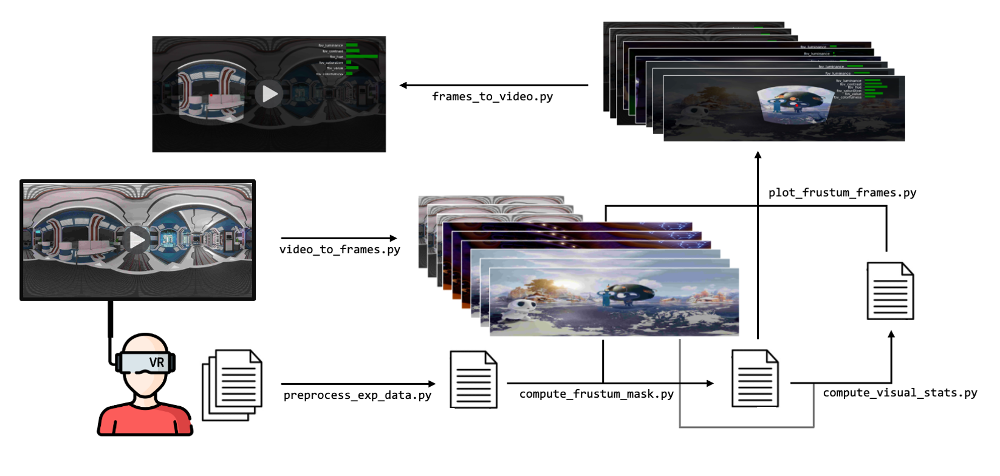

# 🧠 FOV reconstruction for VR experiment


## 📦 Installation

### 1. Create the conda environment

```bash
conda create -n avr_env python=3.9.23 -y          
conda activate avr_env
```

### 2. Install the required packages

```bash
pip install -r requirements.txt
```

## ▶️ Runing the Code



### 0. Obtain VR video frames

```bash
python video_to_frames.py --video_fps 30 --desired_fps 1 --stimuli_dir /path/to/dir
```

| Argument | Default | Description |
|---|---|---|
| `--video_names` | 'None' |  Filenames of MP4 videos whose frames are to be extracted, in their correct order. If None, filename(s) will be read automatically from video directory |
| `--validation` | `False` | Whether to use video presented during validation (with fixation crosses) |
| `--video_fps` | `30` | Original frame rate of the source videos |
| `--desired_fps` | `1` | Frame rate to downsample to when extracting frames |
| `--frame_quality` | `90` | Image quality of each frame from 0 (worse) to 100 (best) |
| `--crop_half` | `False` | If set, crops each frame to half width (for stereo VR footage) |
| `--stimuli_dir` | 'stimuli' | Path to directory containing raw and processed stimuli |
| `--verbose` | `False` | Print progress during code execution |


### 1. Preprocess VR experimental data keeping head and eye tracking data

```bash
python preprocess_exp_data.py --data_dir /path/to/dir --output_dir /path/to/dir --verbose
```

| Argument | Default | Description |
|---|---|---|
| `--sub` | 'None' | Subject ID (e.g., 'sub-001'). If None, it will iterate through all subject directories in data_dir |
| `--validation` | `False` |Whether to preprocess datafiles from validation study |
| `--plot_head_tracking` | `False` | Whether to save plots displaying head tracking data |
| `--data_dir` | 'data' | Path to directory containing raw experimental data |
| `--output_dir` | 'output' | Path to directory containing output of analysis |
| `--verbose` | `False` | Print progress during code execution |


### 2. Compute FOV frustum and gaze fixation for each frame

```bash
python compute_frustum_mask.py --fps 1 --hfov 100 --vfov 100 --n_rays 100 --stimuli_dir /path/to/dir --output_dir /path/to/dir --verbose
```

| Argument | Default | Description |
|---|---|---|
| `--sub` | 'None' | Subject ID (e.g., 'sub-001'). If None, it will iterate through all subject directories in data_dir |
| `--validation` | `False` | Whether to use datafiles from validation study |
| `--fps` | `1` | Frame rate of extracted video frames |
| `--hfov` | `100` | Horizontal field of view in degrees of VR set |
| `--vfov` | `100` | Vertical field of view in degrees of VR set |
| `--n_rays` | `100` | Number of rays to use for frustum computation |
| `--chunk_size` | None | (int) Size of chunks for saving the mask history. If None, will save all data in a single file |
| `--compute_visual_stats` | `False` |  Whether to also compute visual statistics for each frame |
| `--stimuli_dir` | 'stimuli' | Path to directory containing raw and processed stimuli |
| `--output_dir` | 'output' | Path to directory containing output of analysis |
| `--verbose` | `False` | Print progress during code execution |


### 3. Compute low-level visual statistics within FOV

```bash
python compute_visual_stats.py --fps 1 --hfov 100 --vfov 100 --stimuli_dir /path/to/dir --output_dir /path/to/dir --verbose
```

| Argument | Default | Description |
|---|---|---|
| `--sub` | 'None' | Subject ID (e.g., 'sub-001'). If None, it will iterate through all subject directories in data_dir |
| `--validation` | `False` | Whether to use datafiles from validation study |
| `--fps` | `1` | Frame rate data will be downsampled to in order to match frame rate of video frames |
| `--stimuli_dir` | 'stimuli' | Path to directory containing raw and processed stimuli |
| `--output_dir` | 'output' | Path to directory containing output of analysis |
| `--verbose` | `False` | Print progress during code execution |


### 4. Plot each video frame with FOV, gaze fixation, and optionally visual stats

```bash
python plot_frustum_frames.py --fps 1 --hfov 100 --vfov 100  --visual_stats --stimuli_dir /path/to/dir --output_dir /path/to/dir --verbose
```

| Argument | Default | Description |
|---|---|---|
| `--sub` | 'None' | Subject ID (e.g., 'sub-001'). If None, it will iterate through all subject directories in data_dir |
| `--validation` | `False` | Whether to use datafiles from validation study |
| `--fps` | `1` | Frame rate of extracted video frames |
| `--darkening_factor` | `0.75` | Factor by which to darken the image outside the frustum mask (between 0 and 1) |
| `--dpi` | `100` | Resolution of each saved image |
| `--visual_stats` | `False` |Whether to plot (normalized) visual statistics within each frame using activity bars |
| `--stimuli_dir` | 'stimuli' | Path to directory containing raw and processed stimuli |
| `--output_dir` | 'output' | Path to directory containing output of analysis |
| `--verbose` | `False` | Print progress during code execution |

### 5. Create new video with FOV frames (TO COMPLETE)

```bash
python frames_to_video.py --video_fps 30 --desired_fps 1 --output_dir /path/to/dir
```

| Argument | Default | Description |
|---|---|---|
| `--sub` | 'None' | Subject ID (e.g., 'sub-001'). If None, it will iterate through all subject directories in data_dir |
| `--output_dir` | 'output' | Path to directory containing output of analysis |
| `--verbose` | `False` | Print progress during code execution |